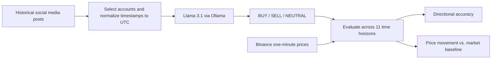

# Crypto Market Signal Detection

**Can an LLM turn cryptocurrency-related social media posts into useful short-term market signals?**

A research project developed for the TU Darmstadt KOM lab, summer semester 2026 (Team T7). The project uses **Llama 3.1 through Ollama** to classify posts from selected public figures and cryptocurrency accounts, then compares those signals with **Binance one-minute price data**.

The main analysis covers **BTC, ETH, DOGE, and TRUMP**. It asks two separate questions: whether a predicted direction matches the subsequent price movement, and whether price movements after posts are larger than typical market movements.

## How it works



Each inference returns a signal, coin relevance, impact strength from 0 to 5, confidence from 0 to 1, and a short explanation. The [main prompt](prompts/minute_base_predict_prompt_v1.md) targets the next **60 minutes**; evaluation also examines horizons from **1 minute to 24 hours**.

Accounts are selected by their relationship to an asset: project representatives, founders, advocates, policy actors, or a token's central public figure. The [selection notes](docs/Selected%20Accounts-Influencers.txt) document the rationale.

| Asset | Selected accounts / figures |
| --- | --- |
| BTC | Michael Saylor, Jack Dorsey, Nayib Bukele |
| ETH | Vitalik Buterin, Tim Beiko, Ethereum, ethereum.org |
| DOGE | Elon Musk |
| TRUMP | Donald Trump |

## Saved results

The repository includes inference outputs and evaluation CSVs in [results/ollama-response_influencer](results/ollama-response_influencer), so the recorded results can be inspected without running a model.

The table below summarizes the **60-minute BUY/SELL directional evaluation** in the committed summary files. NEUTRAL predictions, missing prices, and unchanged prices are excluded from the accuracy denominator.

| Asset | Saved inference rows | Scored BUY/SELL predictions | Correct | Accuracy |
| --- | ---: | ---: | ---: | ---: |
| BTC | 328 | 240 | 127 | 52.92% |
| ETH | 414 | 84 | 39 | 46.43% |
| DOGE | 14,682 | 1,801 | 868 | 48.20% |
| TRUMP | 6,392 | 37 | 23 | 62.16% |

Sources: [BTC / ETH](results/ollama-response_influencer/buy_sell_signal_accuracy_summary.csv), [DOGE](results/ollama-response_influencer/buy_sell_signal_accuracy_summary_elon-DOGE.csv), [TRUMP](results/ollama-response_influencer/buy_sell_signal_accuracy_summary_Trump-Trump%20coin.csv).

These are descriptive results from the saved runs, not evidence of a profitable trading strategy. In particular, TRUMP has a small scored sample, and the DOGE inference file covers only part of the 48,135-row DOGE input slice configured in the runner. Fees, slippage, and execution are not modeled.

## Setup

Use **Python 3.10 or newer** and run commands from the repository root.

```bash
git clone https://github.com/EinePackung/crypto-market-signal-detection.git
cd crypto-market-signal-detection

python3 -m venv .venv
source .venv/bin/activate
python -m pip install pandas langchain-ollama requests
```

These are the dependencies for the main influencer workflow. There is currently no pinned dependency file. Earlier plotting and data-loading experiments also use packages such as `matplotlib` and `kagglehub`.

To generate new predictions, an Ollama server with the `llama3.1` model must be available. For an existing local Ollama installation, start the server and pull the model:

```bash
ollama serve
# Run in a separate terminal:
ollama pull llama3.1
```

The main inference script currently points to a lab-network Ollama server. For local use, change `base_url` in `kom-ollama_influencer.py` to `http://localhost:11434`.

## Run the main workflow

### 1. Prepare the tweet data

The standardizer combines selected CrypTop12 accounts with the Elon Musk and Donald Trump datasets. It deduplicates the selected CrypTop12 posts, converts timestamps to UTC, and writes a common schema.

Expected inputs:

| Input | Expected location |
| --- | --- |
| CrypTop12 raw tweet JSON files | `data/CrypTop12-main/tweet/raw/<coin>/*.json` |
| Elon Musk posts | `data/Elon Musk Tweets/all_musk_posts.csv` |
| Donald Trump posts | `data/Trump Tweets(2009-2025).csv` |

Dataset source URLs and the two supplemental Nayib Bukele rows are recorded in [data/datasets_standardizer.py](data/datasets_standardizer.py). The Musk and Trump CSVs are tracked; CrypTop12 must be obtained separately. New files under `data/` are ignored by Git, while previously tracked files remain included.

```bash
python data/datasets_standardizer.py
```

Output: `data/standardized_influencer_tweets.csv`. The script prints each coin's row range. DOGE input is filtered from April 2, 2019, and TRUMP input from January 18, 2025, using the exact cutoffs in the script.

### 2. Prepare minute-level prices

The [price manifest](data/minute_price_monthly_sources.csv) lists the Binance monthly archives used by the project.

```bash
python scripts/download_binance_1m_klines.py
```

**This downloader saves ZIP archives only.** Extract their CSVs into the corresponding coin folders before evaluating:

```text
data/binance_price_change_per-minute/raw/
├── BTC/BTCUSDT-1m-YYYY-MM.csv
├── ETH/ETHUSDT-1m-YYYY-MM.csv
├── DOGE/DOGEUSDT-1m-YYYY-MM.csv
└── TRUMP/TRUMPUSDT-1m-YYYY-MM.csv
```

The evaluators require named `open_time` and `close_price` columns. For headerless Binance spot kline CSVs, add this header before the first data row:

```csv
open_time,open_price,high_price,low_price,close_price,volume,close_time,quote_asset_volume,number_of_trades,taker_buy_base_asset_volume,taker_buy_quote_asset_volume,ignore
```

Timestamp values may be in milliseconds or microseconds; the evaluators normalize them to milliseconds. Downloaded and prepared price files are not included in the repository.

### 3. Generate signals

Before running [kom-ollama_influencer.py](kom-ollama_influencer.py), edit its configuration:

- Set the Ollama `base_url` and model.
- Choose `coin`: `BTC`, `ETH`, `DOGE`, or `TRUMP`.
- Set `out_csv_file` to the matching coin's output path.
- Check the hardcoded row ranges against the standardizer's printed ranges, especially if the source datasets have changed.

```bash
python kom-ollama_influencer.py
```

The script currently defaults to DOGE. It saves progress every 10 successful responses and at the end, but **does not resume an existing output file**. Running it again replaces the selected output, so use a new output path to preserve a previous run. Create the parent directory if you choose a new location.

Skip this step when evaluating the committed inference outputs.

### 4. Evaluate

With the price CSVs prepared, run:

```bash
python evaluation_LLM_signal_accuracy.py
python evaluation_price_change_ratio.py
```

Both scripts default to **BTC + ETH**. For DOGE or TRUMP, update the input files, price folders, and output paths in `evaluation_LLM_signal_accuracy.py`; select the corresponding `coin` in `evaluation_price_change_ratio.py`. Re-running evaluation replaces the configured result files.

Outputs include:

| File pattern | Contents |
| --- | --- |
| `buy_sell_signal_accuracy_by_event*.csv` | Per-post price changes and whether the predicted direction was correct |
| `buy_sell_signal_accuracy_summary*.csv` | Accuracy by asset, signal, and time horizon |
| `influencer_tweet_price_change_rate_events*.csv` | Absolute price changes and comparisons with market baselines |
| `influencer_tweet_price_change_rate_summary*.csv` | Aggregated price-change rates and baseline ratios |

## Evaluation details

- **Horizons:** 1, 3, 5, 10, 15, 30, 60, 120, 360, 720, and 1,440 minutes.
- **Time alignment:** a post's timestamp is rounded up to a minute boundary. The reference price is the close of the candle whose `open_time` matches that boundary; the comparison uses the close at the target minute.
- **Directional accuracy:** BUY is correct when the price rises; SELL is correct when it falls. Accuracy is `correct / (correct + wrong) × 100`. Flat prices and unavailable prices are reported separately.
- **Movement magnitude:** absolute returns after posts are compared with average absolute returns over the available price data and within the post's month. Results are grouped into all posts and BUY/SELL posts.
- **Baseline scope:** the market baseline includes all eligible price windows, including windows near posts. It is not a control group with influencer posts removed, and the comparison does not establish causation.

## Repository guide

| Path | Purpose |
| --- | --- |
| `kom-ollama_influencer.py` | Main inference runner for selected influencer datasets |
| `evaluation_LLM_signal_accuracy.py` | Minute-level BUY/SELL directional evaluation |
| `evaluation_price_change_ratio.py` | Post-event price movements vs. market baselines |
| `data/datasets_standardizer.py` | Dataset selection and common UTC schema |
| `scripts/download_binance_1m_klines.py` | Monthly price archive downloader |
| `scripts/run_crypTop12_ollama_remaining.py` | Separate popularity-filtered CrypTop12 runner with resume support |
| `prompts/` | Prompt iterations and the minute-level classification prompt |
| `results/ollama-response_influencer/` | Saved predictions and evaluation results |
| `docs/` | Concept, report, posters, presentation, and manual validation |

Earlier experiments remain in `kom-ollama.py`, `batch-ollama.py`, `evaluation.py`, and related scripts. Their input schemas, prompts, and daily evaluation differ from the main minute-level workflow described above.

## Project documents

- [Project concept](docs/T7_Concept.pdf)
- [Report — version 1](docs/Report_Version1.pdf)
- [Poster — version 2](docs/Poster_Version_2.pdf)
- [Presentation](docs/crypto_signal_presentation.pptx)
- [LLM vs. human signal validation](docs/LLM_vs_Human_Signal_Validierung.pdf)
